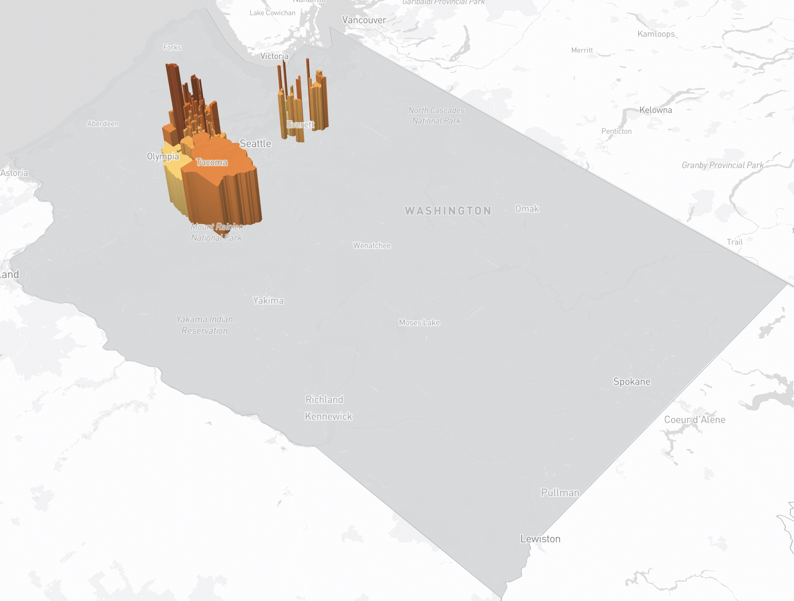

# Washington Social and Economic Conditions Map

### [Website Link](https://haochenmiao.github.io/Washington_Socioeconomic_Map/)

## Team Member:
- Haochen Miao

## Project Description:

This project is an interactive web map that visualizes key social and economic variables for each census tract in Washington state. The map is three-dimensional and represents these variables using the height and color of each tract’s polygon. For example, if the map is displaying the percentage of people living in poverty within a census tract, lower percentages are shown with short and light-colored polygons, while higher percentages are represented by tall and dark-colored polygons. The specific variable being displayed is indicated by a legend on the right-hand side of the map and can be changed using a menu on the left-hand side, allowing users to switch between different datasets. Additionally, users can click on a census tract to view more detailed information, such as the tract's relative position in the overall distribution of the variable.

Although the map is the centerpiece of this project, it is only one component of our broader website, which consists of four pages. The first page provides a disclaimer, along with an introduction to the data sources and visual strategies used. The second page hosts the interactive map itself. The third page offers details on the datasets used, including other recommended datasets. Finally, the fourth page presents background information on our team and the project’s objectives.

## Screenshots

### Map 1 - Lead in Housing Units

### Map 2 - Diesel and NoX Emissions

### Map 3 - Ozone Concentrations

### Map 4 - PM 2.5 Air Pollution Count

### Map 5 - Proximity to Heavy Traffic

### Map 6 - Hazardous Chemical Releases

## Project Goal:

My goal is to highlight the socioeconomic conditions across Washington state by visualizing key variables such as poverty rates, unemployment, education levels, and racial demographics. By mapping these indicators, we aim to reveal the disparities and inequalities that exist within different communities. We also hope to inspire researchers, urban planners, and policymakers to use this data to better understand the distribution of socioeconomic challenges, encourage the gathering of additional datasets, and foster the creation of digital tools that bring attention to these critical issues, ultimately supporting efforts toward social and economic equity.

## Data Sources

Most of the datasets used in this project are drawn from the socioeconomic disparities section of the [Washington Geospatial Open Data Portal](https://geo.wa.gov/). These datasets represent key indicators such as education, income, housing, and racial demographics across Washington State census tracts. A cartographic shapefile was used to clip census tracts, and a dataset containing the location of Washington cities was used to enable the location search function in the map. Below is a brief description and link to each dataset used.

1. **[Low Birth Weight (Current Version)](https://geo.wa.gov/datasets/WADOH::low-birth-weight-current-version/about)**  
   This dataset contains information on the percentage of low birth weight singleton live births in each Washington State census tract.

2. **[People of Color (Current Version)](https://geo.wa.gov/datasets/WADOH::people-of-color-current-version/about)**  
   This dataset provides information on the percentage of the population identified as people of color within each census tract.

3. **[No High School Diploma (Current Version)](https://geo.wa.gov/datasets/WADOH::no-high-school-diploma-current-version/about)**  
   This dataset shows the percentage of individuals over the age of 24 without a high school diploma in each census tract.

4. **[Population Living in Poverty (Current Version)](https://geo.wa.gov/datasets/WADOH::population-living-in-poverty-current-version/about)**  
   This dataset contains information on the percentage of the population living below the poverty line in Washington State census tracts.

5. **[Unaffordable Housing (Current Version)](https://geo.wa.gov/datasets/WADOH::unaffordable-housing-current-version/about)**  
   This dataset contains information on the percentage of households in each census tract that are paying more than 30% of their income on housing costs.

6. **[Unemployed Population (Current Version)](https://geo.wa.gov/datasets/WADOH::toxic-releases-from-facilities-rsei-model-current-version/about)**  
   This dataset provides information on the percentage of the population that is unemployed in each Washington census tract.

7. **[Coordinates of Cities in Washington State](https://www.mapsofworld.com/usa/states/washington/lat-long.html)**  
   This dataset contains the coordinates of cities in Washington State to facilitate navigation within the map.

8. Besides the data from the Washington Geospatial Open Data Portal, a [cartographic boundary map](https://www.census.gov/geographies/mapping-files/time-series/geo/carto-boundary-file.html) of the Washington state land area was used.

9. For browsing different cities, the coordinates were acquired from the [Maps of World](https://www.mapsofworld.com/usa/states/washington/lat-long.html) and later converted into a CSV file.

## Applied Libraries:

Mapbox GL js

Bootstrap 5

Google Fonts

Font Awesome

D3 js

## Other Information:

To allow for the data from each dataset to be readily comparable across different scales, each variable used in the map was normalized using min-max normalization. The normalized values of each variable were then used to assign the height and color of census tract polygons.

Aside from min-max normalization, the geometry of the data was clipped using a cartographic boundary map from the United States census bureau. Clipping was performed on the data to limit census tract extent to only land areas, thereby improving geographic legibility.

The website of this project is best viewed in Google Chrome, Firefox, or Microsoft Edge. While the website and map contained in it can run on other browsers, certain map and website elements may be missing, dysfunctional, or otherwise improperly displayed.